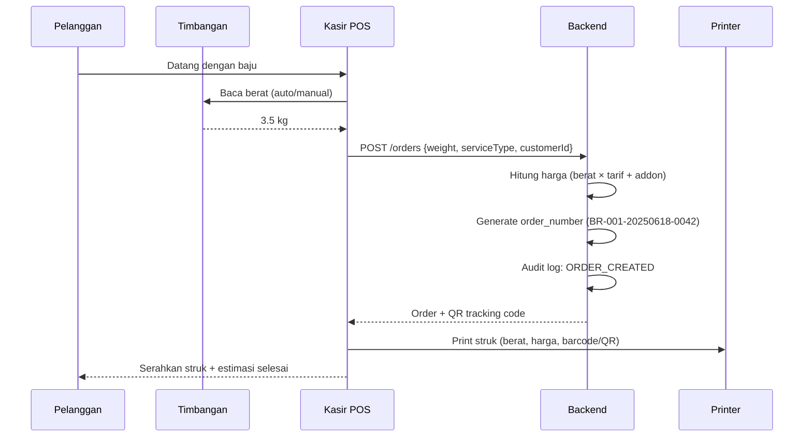
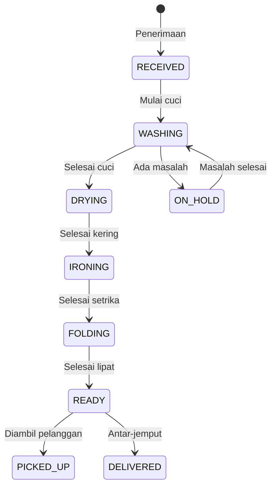
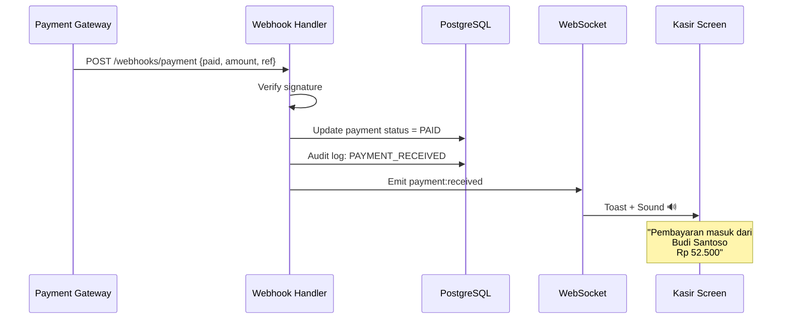
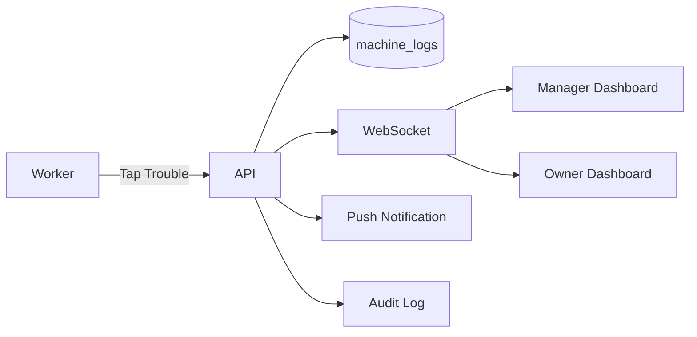

# AWW Laundry — Franchise Laundry Management Platform

## Technical Blueprint v1.0

> **Product:** SaaS multi-tenant franchise laundry management  
> **Stack:** Next.js 15 (App Router) · React 19 · PostgreSQL · TypeScript  
> **Target:** Franchise owner, cabang, kasir, pekerja, pelanggan

---

## 1. Executive Summary

AWW Laundry adalah platform operasional end-to-end untuk bisnis franchise laundry. Sistem mencakup penerimaan berat otomatis, tracking produksi real-time, multi-payment Indonesia, dashboard keuangan, RBAC per cabang, audit trail, laporan PDF otomatis, dan AI business intelligence.

### Value Proposition untuk Franchise


| Pain Point                                | Solusi AWW Laundry                                |
| ----------------------------------------- | ------------------------------------------------- |
| Pencatatan manual & salah hitung          | Auto-capture berat + harga + print struk          |
| Pelanggan tidak tahu status cucian        | Tracking real-time + notifikasi WhatsApp/SMS/Push |
| Sulit audit uang vs barang                | Stock opname + rekonsiliasi kas otomatis          |
| Owner tidak punya visibility multi-cabang | Dashboard franchise + laporan PDF bulanan         |
| Pembayaran tersebar                       | QRIS, transfer, e-wallet terintegrasi             |


---

## 2. System Architecture

```
┌─────────────────────────────────────────────────────────────────────────┐
│                         CLIENT LAYER                                     │
├──────────────┬──────────────┬──────────────┬───────────────────────────┤
│  POS Web     │  Worker App  │  Customer    │  Owner/Manager            │
│  (Kasir)     │  (Tablet)    │  Portal      │  Dashboard                │
│  Next.js     │  Next.js PWA │  Next.js     │  Next.js + GSAP Charts    │
└──────┬───────┴──────┬───────┴──────┬───────┴───────────┬───────────────┘
       │              │              │                   │
       └──────────────┴──────────────┴───────────────────┘
                              │
                    ┌─────────▼─────────┐
                    │   Next.js API     │
                    │   Route Handlers  │
                    │   + Server Actions│
                    └─────────┬─────────┘
                              │
       ┌──────────────────────┼──────────────────────┐
       │                      │                      │
┌──────▼──────┐    ┌──────────▼──────────┐   ┌──────▼──────┐
│ PostgreSQL  │    │  Redis (Upstash)      │   │  BullMQ     │
│ (Prisma)    │    │  Session + Cache      │   │  Job Queue  │
└─────────────┘    └───────────────────────┘   └──────┬──────┘
                                                        │
       ┌────────────────────────────────────────────────┤
       │              │              │                │
┌──────▼──────┐ ┌─────▼─────┐ ┌──────▼──────┐ ┌──────▼──────┐
│ Midtrans/   │ │  Brevo    │ │  OpenAI     │ │  WebSocket  │
│ Xendit      │ │  Email    │ │  GPT-4o     │ │  (Socket.io)│
│ Payment GW  │ │  API      │ │  API        │ │  Real-time  │
└─────────────┘ └───────────┘ └─────────────┘ └─────────────┘
```

### Tech Stack Detail


| Layer     | Technology                                  | Alasan                         |
| --------- | ------------------------------------------- | ------------------------------ |
| Frontend  | Next.js 15 App Router, React 19, TypeScript | SSR + RSC, SEO customer portal |
| UI        | Tailwind CSS, shadcn/ui, Vibe Design System | Konsistensi franchise branding |
| Animation | GSAP 3 + ScrollTrigger, Lottie React        | Premium UX differentiation     |
| Charts    | Recharts + GSAP number counter              | Animated dashboard             |
| State     | Zustand (client) + TanStack Query (server)  | Lightweight, predictable       |
| ORM       | Prisma 6                                    | Type-safe PostgreSQL           |
| Auth      | NextAuth.js v5 (Auth.js)                    | RBAC + multi-tenant            |
| Real-time | Socket.io / Pusher / Ably                   | Status update, payment alert   |
| Queue     | BullMQ + Redis                              | PDF generation, email, webhook |
| PDF       | @react-pdf/renderer + Puppeteer             | Laporan bulanan                |
| Email     | Brevo (Sendinblue) API                      | Transaksional + scheduled      |
| AI        | OpenAI GPT-4o + function calling            | Chatbot + business analysis    |
| Print     | ESC/POS via WebUSB / Bluetooth / Network    | Struk thermal                  |
| Scale     | Serial API / HID / Custom bridge            | Integrasi timbangan digital    |
| Deploy    | Vercel (app) + Railway/Supabase (DB)        | Scalable franchise SaaS        |
| Storage   | S3/R2 (bukti transfer, logo cabang)         | Object storage                 |

### Project Instance — Environment Aktif

> Detail lengkap semua variable: **[ENV-SECRETS.md](./ENV-SECRETS.md) Section 0**

| Resource | Nilai |
|---|---|
| GitHub Repo | `https://github.com/adebasirwfrd-arch/AWWLaundry.git` |
| Supabase Project ID | `svsakpnvikwrdoxxnfys` |
| Supabase URL | `https://svsakpnvikwrdoxxnfys.supabase.co` |
| Google Cloud Project | `csms-application-478203` |
| Google OAuth Client ID | `1056146520050-scqqdt75ablueftnaf5453ctctl6r7m2.apps.googleusercontent.com` |
| Expo EAS Project ID | `56aa0cad-497c-4e5f-af20-1d866f93e8b7` |
| Brevo Sender Email | `adeazhar.wfrd@gmail.com` |
| OpenAI Model Chatbot | `gpt-4o-mini` |
| OpenAI Model Business | `gpt-4o-mini` |

**Status konfigurasi env:**

| Fase | Status | Catatan |
|---|---|---|
| Phase 1 — Supabase, Auth, Google, Brevo | ✅ Dikonfigurasi | `DATABASE_URL` perlu password DB dari Supabase Dashboard |
| Phase 2 — Redis, Midtrans, R2, Socket | ⏳ Dummy | Update `.env.local` saat service siap |
| Phase 3 — OpenAI | ✅ Dikonfigurasi | Key di `.env.local` |
| Phase 4 — EAS, FCM, WhatsApp | ⏳ Sebagian | EAS ID siap; iOS/Android Google client & FCM belum |

**File env project:**
- `.env.example` — template aman (boleh di-commit)
- `.env.local` — secret asli (**gitignored**, jangan push ke GitHub)

**⚠️ Google OAuth redirect URI wajib:**
`http://localhost:3000/api/auth/callback/google` (bukan hanya `/`)


---

## 3. Multi-Tenant & RBAC Model

### Hierarchy Tenant

```
Franchise (Organization)
  └── Branch (Cabang) — isolasi data utama
        ├── Users (karyawan per cabang)
        ├── Machines (mesin cuci per cabang)
        ├── Orders (transaksi)
        └── Inventory (stock opname per cabang)
```

### Role Matrix


| Permission                | Super Admin | Owner | Manager | Cashier | Worker | Customer |
| ------------------------- | ----------- | ----- | ------- | ------- | ------ | -------- |
| Lihat semua cabang        | ✅           | ✅     | ❌       | ❌       | ❌      | ❌        |
| Kelola cabang             | ✅           | ✅     | ❌       | ❌       | ❌      | ❌        |
| Dashboard keuangan/profit | ✅           | ✅     | ✅       | ❌       | ❌      | ❌        |
| Penerimaan & payment      | ✅           | ✅     | ✅       | ✅       | ❌      | ❌        |
| Update status produksi    | ✅           | ✅     | ✅       | ✅       | ✅      | ❌        |
| Lapor mesin trouble       | ✅           | ✅     | ✅       | ✅       | ✅      | ❌        |
| Lihat order sendiri       | —           | —     | —       | —       | —      | ✅        |
| AI Business Analysis      | ✅           | ✅     | ✅       | ❌       | ❌      | ❌        |
| AI Chatbot umum           | ✅           | ✅     | ✅       | ✅       | ✅      | ✅        |
| Audit trail               | ✅           | ✅     | ✅       | ❌       | ❌      | ❌        |
| Konfigurasi laporan PDF   | ✅           | ✅     | ❌       | ❌       | ❌      | ❌        |


### RBAC Implementation

```typescript
// Permission-based, bukan role-only
enum Permission {
  ORDER_CREATE = 'order:create',
  ORDER_UPDATE_STATUS = 'order:update_status',
  PAYMENT_RECEIVE = 'payment:receive',
  FINANCE_VIEW = 'finance:view',
  FINANCE_PROFIT_VIEW = 'finance:profit_view', // owner + manager only
  MACHINE_REPORT_TROUBLE = 'machine:report_trouble',
  AUDIT_VIEW = 'audit:view',
  AI_BUSINESS_QUERY = 'ai:business_query',
  BRANCH_MANAGE = 'branch:manage',
}

// Scope: organization_id + branch_id (nullable untuk owner cross-branch)
interface AuthContext {
  userId: string;
  organizationId: string;
  branchIds: string[]; // worker/cashier: 1 branch, owner: all
  permissions: Permission[];
}
```

---

## 4. Core Business Flow

### 4.1 Flow Penerimaan (Step 1–2)




**Auto-print struk berisi:**

- Logo AWW Laundry (Lottie static frame saat print)
- No. order, tanggal, nama pelanggan
- Berat (kg), jenis layanan, harga per kg, total
- QR code tracking
- Estimasi selesai
- Cabang & kontak

### 4.2 Flow Produksi (Step 3)




**Setiap transisi status:**

1. Worker tap/swipe di tablet produksi
2. `order_status_logs` insert + `audit_logs` insert
3. WebSocket broadcast ke dashboard cabang
4. Notifikasi ke pelanggan (WhatsApp/SMS/Push) — configurable per status
5. GSAP animasi progress bar di customer portal

### 4.3 Flow Selesai & Notifikasi (Step 4)

```
Order status → READY
  ├── Trigger: notifikasi otomatis ke pelanggan
  │     ├── WhatsApp (Fonnte/Wablas API) — opsional addon
  │     ├── SMS (Twilio/Zenziva)
  │     └── Push notification (web push)
  ├── Masuk laporan "Selesai Hari Ini"
  └── Dashboard counter real-time update
```

### 4.4 Flow Harian (Step 5)

**Daily Snapshot Table** (`daily_branch_summaries`) — di-generate setiap jam + final EOD:


| Metric                   | Sumber                              |
| ------------------------ | ----------------------------------- |
| Masuk (orders created)   | `orders WHERE created_at = today`   |
| Keluar (ready)           | `orders WHERE ready_at = today`     |
| Diambil (picked up)      | `orders WHERE picked_up_at = today` |
| Pendapatan kas           | `payments WHERE paid_at = today`    |
| Piutang                  | `orders unpaid total`               |
| Berat total masuk/keluar | SUM(weight)                         |


---

## 5. Payment System (Step 6)

### Supported Methods


| Method        | Provider              | Flow                        |
| ------------- | --------------------- | --------------------------- |
| Cash          | Manual                | Kasir input, auto audit     |
| QRIS          | Midtrans/Xendit       | Dynamic QR, webhook confirm |
| Transfer Bank | Manual + upload bukti | Kasir verify / auto-match   |
| GoPay         | Midtrans              | Deep link / QR              |
| ShopeePay     | Midtrans/Xendit       | QR                          |
| OVO, DANA     | Midtrans              | QR                          |


### Payment Notification Flow




### Payment Sound Component

```typescript
// GSAP animate toast slide-in + play cash register sound
// usePaymentNotification hook via Socket.io
interface PaymentNotification {
  clientName: string;
  amount: number;
  method: PaymentMethod;
  orderNumber: string;
  branchId: string;
}
```

---

## 6. Database Schema (PostgreSQL)

### Core Tables

```sql
-- MULTI-TENANT
organizations (id, name, slug, logo_url, settings JSONB, created_at)
branches (id, org_id, name, address, phone, settings JSONB, is_active)
users (id, org_id, email, name, phone, avatar_url, is_active)
user_branch_roles (user_id, branch_id, role, permissions TEXT[])

-- CUSTOMERS
customers (id, org_id, name, phone, email, address, loyalty_points)

-- PRICING
service_types (id, org_id, name, price_per_kg, estimated_hours)
branch_pricing (branch_id, service_type_id, price_per_kg) -- override per cabang

-- ORDERS
orders (
  id, branch_id, customer_id, order_number,
  weight_kg, service_type_id,
  subtotal, discount, total,
  status, -- enum
  payment_status, -- UNPAID | PARTIAL | PAID
  estimated_ready_at, ready_at, picked_up_at,
  created_by, notes
)

order_status_logs (id, order_id, from_status, to_status, changed_by, note, created_at)
order_items (id, order_id, description, qty) -- addon: parfum, anti kusut

-- PAYMENTS
payments (
  id, order_id, branch_id, amount, method,
  gateway_ref, status, paid_at, received_by,
  proof_url -- bukti transfer
)

-- MACHINES
machines (id, branch_id, name, type, capacity_kg, status, last_maintenance)
machine_logs (id, machine_id, event_type, reported_by, note, resolved_at)
-- event_type: IDLE | RUNNING | TROUBLE | MAINTENANCE

-- INVENTORY / STOCK OPNAME
inventory_items (id, branch_id, name, unit, min_stock)
stock_movements (id, item_id, type, qty, reference, created_by)
stock_opnames (id, branch_id, period, status, approved_by)
stock_opname_lines (opname_id, item_id, system_qty, physical_qty, variance)

-- FINANCE
expenses (id, branch_id, category, amount, description, date, created_by)
daily_branch_summaries (branch_id, date, metrics JSONB)

-- AUDIT
audit_logs (
  id, org_id, branch_id, user_id,
  action, entity_type, entity_id,
  old_value JSONB, new_value JSONB,
  ip_address, user_agent, created_at
)

-- NOTIFICATIONS
notifications (id, user_id, type, title, body, data JSONB, read_at)
notification_settings (org_id, event_type, channels JSONB)

-- REPORTS
report_schedules (id, org_id, day_of_month, recipient_emails[], template)
report_history (id, schedule_id, sent_at, file_url, status)

-- AI
ai_conversations (id, user_id, type, -- CHATBOT | BUSINESS_ANALYSIS
  messages JSONB, created_at)
```

### Indexes Kritis

```sql
CREATE INDEX idx_orders_branch_status ON orders(branch_id, status, created_at DESC);
CREATE INDEX idx_orders_customer ON orders(customer_id, created_at DESC);
CREATE INDEX idx_payments_branch_date ON payments(branch_id, paid_at);
CREATE INDEX idx_audit_org_date ON audit_logs(org_id, created_at DESC);
CREATE INDEX idx_daily_summary ON daily_branch_summaries(branch_id, date);
```

---

## 7. Audit Trail (Step 7)

### Prinsip

- **Immutable** — tidak ada UPDATE/DELETE pada `audit_logs`
- **Comprehensive** — setiap aksi sensitif tercatat
- **Queryable** — filter by user, entity, date range, branch

### Events yang Di-audit

```
ORDER_CREATED, ORDER_STATUS_CHANGED, ORDER_CANCELLED,
PAYMENT_RECEIVED, PAYMENT_REFUNDED,
PRICE_OVERRIDE, DISCOUNT_APPLIED,
USER_LOGIN, USER_LOGOUT, PERMISSION_CHANGED,
MACHINE_TROUBLE_REPORTED, MACHINE_RESOLVED,
STOCK_OPNAME_CREATED, STOCK_ADJUSTED,
EXPENSE_CREATED, EXPENSE_DELETED,
SETTINGS_CHANGED, REPORT_GENERATED
```

### Middleware Pattern

```typescript
async function withAudit<T>(
  ctx: AuthContext,
  action: AuditAction,
  entity: { type: string; id: string },
  fn: () => Promise<T>
): Promise<T> {
  const oldValue = await getEntitySnapshot(entity);
  const result = await fn();
  const newValue = await getEntitySnapshot(entity);
  await prisma.auditLog.create({
    data: { ...ctx, action, entityType: entity.type, entityId: entity.id, oldValue, newValue }
  });
  return result;
}
```

---

## 8. State Management (Step 12)

### Architecture

```
Server State (TanStack Query)     Client State (Zustand)
├── orders, customers             ├── UI: sidebar, modals, theme
├── dashboard stats               ├── POS: cart, current weight
├── machines status               ├── notifications queue
├── payments                      ├── print queue
└── AI conversations              └── GSAP animation refs
```

### Store Structure

```typescript
// stores/pos-store.ts
interface POSStore {
  currentCustomer: Customer | null;
  currentWeight: number;
  selectedService: ServiceType | null;
  isScaleConnected: boolean;
  setWeight: (kg: number) => void;
  calculateTotal: () => number;
  reset: () => void;
}

// stores/notification-store.ts
interface NotificationStore {
  queue: PaymentNotification[];
  add: (n: PaymentNotification) => void;
  dismiss: (id: string) => void;
}
```

### Real-time Sync

- TanStack Query `invalidateQueries` on WebSocket events
- Optimistic updates untuk status change (rollback on error)

---

## 9. Dashboard & Analytics (Step 13)

### Owner/Manager Dashboard Widgets


| Widget                     | Data                         | Animasi                    |
| -------------------------- | ---------------------------- | -------------------------- |
| Revenue Hari Ini           | `daily_branch_summaries`     | GSAP counter 0→nilai       |
| Order Pipeline             | count per status             | Stacked bar chart Recharts |
| Masuk vs Keluar vs Diambil | daily metrics                | Line chart animated        |
| Leaderboard Pekerja        | `order_status_logs` per user | Ranking card GSAP stagger  |
| Top Pelanggan              | order count + revenue        | Table animated rows        |
| Profit & Margin            | revenue - expenses - COGS    | Area chart                 |
| Pengeluaran Breakdown      | expenses by category         | Donut chart                |
| Machine Status             | real-time machine state      | Status grid + pulse        |
| Piutang                    | unpaid orders                | Alert card                 |
| Cabang Comparison          | multi-branch (owner only)    | Bar chart                  |


### Financial Analysis

```
Pendapatan = SUM(payments.paid)
Pengeluaran = SUM(expenses) + SUM(stock purchases) + SUM(utilities)
Profit = Pendapatan - Pengeluaran - COGS
Margin = Profit / Pendapatan × 100%
```

### Stock Opname Reconciliation

```
Expected Cash = Opening Balance + Cash Payments - Cash Expenses
Actual Cash = Physical count (input opname)
Variance = Actual - Expected → flag if > threshold

Expected Stock = Last opname + IN - OUT
Physical Stock = Count input
Variance → audit + alert manager
```

---

## 10. Machine Management & Trouble Alerts (Step 14)




**Machine Status Enum:** `IDLE` | `RUNNING` | `TROUBLE` | `MAINTENANCE` | `OFFLINE`

**Trouble flow:**

1. Worker pilih mesin → "Lapor Trouble" → pilih kategori (bocor, motor mati, dll) + foto opsional
2. Status mesin → `TROUBLE`, dashboard menampilkan alert merah pulse (GSAP)
3. Notifikasi real-time ke Manager + Owner cabang tersebut
4. Manager resolve → status kembali `IDLE`, log ditutup

---

## 11. Automated PDF Reports via Brevo (Step 14)

### Schedule Configuration

```typescript
interface ReportSchedule {
  organizationId: string;
  dayOfMonth: number; // 1-28
  time: string; // "08:00"
  timezone: string; // "Asia/Jakarta"
  recipientEmails: string[];
  branches: string[] | 'ALL';
  sections: ReportSection[]; // revenue, expenses, profit, orders, workers, machines
}
```

### Generation Pipeline (BullMQ Cron)

```
Cron trigger (configurable date)
  → Aggregate monthly data per branch
  → Render PDF (@react-pdf/renderer)
  → Upload to S3
  → Send via Brevo API (attachment)
  → Log to report_history
  → Audit: REPORT_GENERATED
```

### PDF Contents

1. Cover — logo franchise + periode
2. Executive Summary — revenue, profit, growth %
3. Per-cabang breakdown
4. Order statistics (masuk, selesai, diambil)
5. Payment method breakdown
6. Top 10 pelanggan
7. Worker performance
8. Machine downtime report
9. Expense summary
10. Stock opname variance (if any)

---

## 12. AI Features (Step 15–16)

### 12.1 Customer Chatbot

- **Model:** GPT-4o-mini (cost efficient)
- **Scope:** FAQ, cek status order (via function calling), jam operasional, harga layanan
- **Tidak bisa akses:** data keuangan, data cabang lain

```typescript
const chatbotTools = [
  { name: 'get_order_status', params: { orderNumber: string } },
  { name: 'get_branch_info', params: { branchId: string } },
  { name: 'get_service_pricing', params: { branchId: string } },
];
```

### 12.2 Business AI Analysis (Owner/Manager)

- **Model:** GPT-4o
- **Scope:** Semua data bisnis dalam organization/branch user
- **Function calling ke database:**

```typescript
const businessTools = [
  { name: 'query_revenue', params: { branchId?, dateFrom, dateTo } },
  { name: 'query_expenses', params: { branchId?, category?, dateFrom, dateTo } },
  { name: 'query_orders', params: { status?, branchId?, dateFrom, dateTo } },
  { name: 'query_worker_performance', params: { branchId, dateFrom, dateTo } },
  { name: 'query_stock_variance', params: { branchId, opnameId? } },
  { name: 'query_profit_analysis', params: { branchId?, dateFrom, dateTo } },
  { name: 'compare_branches', params: { dateFrom, dateTo } },
  { name: 'cash_reconciliation', params: { branchId, date } },
];
```

**Contoh pertanyaan owner:**

- "Berapa profit cabang Jakarta Selatan bulan ini?"
- "Cabang mana yang paling boros pengeluaran?"
- "Apakah stock opname kemarin cocok dengan uang kas?"
- "Siapa pekerja paling produktif minggu ini?"
- "Bandingkan revenue 3 bulan terakhir semua cabang"

### AI Safety

- RBAC check sebelum setiap tool execution
- Rate limiting per user (50 queries/day business, 200/day chatbot)
- Prompt injection guard
- Tidak expose raw SQL ke model — hanya structured API responses
- Log semua AI queries ke `ai_conversations` + audit

---

## 13. Animation & UX — Rainbow Bubbles Theme

> **Logo resmi:** `assets/brand/aww-laundry-logo.png`  
> **Panduan lengkap:** [BRAND-ANIMATION.md](./BRAND-ANIMATION.md)  
> **Tagline brand:** FRESH • CLEAN • FUN  
> **Prinsip:** Semua elemen UI bergerak bagaikan **gelembung pelangi** — fluid, playful, premium

### Identitas Visual dari Logo

| Elemen Logo | Implementasi UI |
|---|---|
| Huruf AWW fluid rainbow | Gradient `--aww-gradient-rainbow` di progress, border, highlight |
| Gelembung transparan | GSAP particle system 3 layer (besar/sedang/kecil) |
| Maskot tetesan air | Lottie `water-droplet-mascot.json` — loading & empty state |
| Mesin cuci berkedip (huruf W) | Lottie `washing-machine-wink.json` — status cuci |
| Pelangi atas logo | Lottie `rainbow-arc.json` + CSS `aww-rainbow-shift` |
| Orange "DRY" | CTA button `gradient-cta` |
| Navy "LAUN" | Header, text heading `#1E3A6E` |
| Cream background | App background `#FAFAF8` |

### GSAP — Rainbow Bubble System

| Area | Animasi Gelembung |
|---|---|
| Splash / Login | Logo Lottie reveal + 20+ bubbles float/pop + rainbow border flow |
| Auth form focus | Bubble shimmer + rainbow border aktif pada input |
| Button hover/click | Scale bounce + mini bubble burst (`elastic.out`) |
| Dashboard load | Bubbles slow float background + KPI counter roll-up |
| Order status | Rainbow progress flow + bubble trail antar step |
| Payment masuk 🔊 | Toast slide + `payment-rainbow-burst.json` + bubble pop |
| Page transitions | Bubbles fade morph + shared element transition |
| Settings tab switch | Crossfade + bubble drift across panel |
| Machine trouble | Red pulse bubble (exception — bukan pelangi) |

### Lottie Assets (dari Logo)

```
public/lottie/
  ├── logo-reveal.json              # Splash — logo + gelembung muncul
  ├── bubble-float-loop.json        # Background infinite — semua halaman auth
  ├── water-droplet-mascot.json     # Maskot tetesan air dari logo
  ├── washing-machine-wink.json     # Mesin cuci huruf W berkedip
  ├── rainbow-arc.json              # Pelangi atas logo — pulse
  ├── washing-bubbles.json          # Status: cuci
  ├── ironing-sparkle.json          # Status: setrika
  ├── folding-clothes.json          # Status: lipat
  ├── payment-rainbow-burst.json    # Pembayaran masuk — celebration
  ├── bubble-spinner.json           # Global loader — gelembung berputar
  └── floating-bubbles-empty.json   # Empty state
```

### Warna Animasi = Warna Logo

```
Pink #FF5C9A → Orange #FF8C2A → Yellow #FFD23F → Green #6BCB77
→ Cyan #4ECDC4 → Blue #4A90D9 → Purple #9B59B6
```

Gelembung menggunakan `radial-gradient` putih→warna rainbow dengan opacity 0.25–0.55 dan `box-shadow: glow-bubble`.

### Performance Rules

- Max 40 bubbles on screen (mobile: 20)
- Max 3 Lottie concurrent
- `prefers-reduced-motion` → disable float, keep fade only
- `gsap.context()` cleanup on unmount
- Lazy load Lottie below fold
- `will-change` only during animation
- `gsap.context()` cleanup on unmount
- Respect `prefers-reduced-motion`

---

## 14. API Design

### RESTful + Server Actions

```
# Orders
POST   /api/v1/branches/:branchId/orders
GET    /api/v1/branches/:branchId/orders
PATCH  /api/v1/orders/:id/status
GET    /api/v1/orders/:id/track          # public (customer)

# Payments
POST   /api/v1/orders/:id/payments
POST   /api/v1/webhooks/midtrans
POST   /api/v1/webhooks/xendit

# Dashboard
GET    /api/v1/branches/:branchId/dashboard/daily
GET    /api/v1/branches/:branchId/dashboard/analytics
GET    /api/v1/organizations/:orgId/dashboard/multi-branch

# Machines
GET    /api/v1/branches/:branchId/machines
POST   /api/v1/machines/:id/trouble
PATCH  /api/v1/machines/:id/resolve

# Stock Opname
POST   /api/v1/branches/:branchId/stock-opnames
GET    /api/v1/stock-opnames/:id/reconciliation

# Reports
POST   /api/v1/report-schedules
GET    /api/v1/reports/generate/:month    # manual trigger

# AI
POST   /api/v1/ai/chatbot
POST   /api/v1/ai/business-analysis
GET    /api/v1/ai/conversations

# Audit
GET    /api/v1/audit-logs?branchId&from&to&action

# Print
POST   /api/v1/orders/:id/print-receipt
```

---

## 15. Project Structure

```
aww-laundry/
├── apps/
│   └── web/                          # Next.js monorepo app
│       ├── app/
│       │   ├── (auth)/               # login, register
│       │   ├── (dashboard)/
│       │   │   ├── owner/            # franchise dashboard
│       │   │   ├── manager/
│       │   │   ├── cashier/          # POS
│       │   │   ├── worker/           # production board
│       │   │   └── settings/
│       │   ├── (customer)/           # tracking portal
│       │   ├── api/
│       │   │   ├── v1/
│       │   │   └── webhooks/
│       │   └── layout.tsx
│       ├── components/
│       │   ├── ui/                   # shadcn
│       │   ├── pos/                  # scale, printer, cart
│       │   ├── dashboard/            # charts, widgets
│       │   ├── animations/           # GSAP + Lottie wrappers
│       │   ├── notifications/        # payment toast + sound
│       │   └── ai/                   # chat interface
│       ├── lib/
│       │   ├── prisma.ts
│       │   ├── auth.ts
│       │   ├── rbac.ts
│       │   ├── audit.ts
│       │   ├── payments/
│       │   ├── ai/
│       │   ├── reports/
│       │   └── websocket/
│       ├── stores/                   # Zustand
│       ├── hooks/
│       └── types/
├── packages/
│   ├── database/                     # Prisma schema + migrations
│   ├── shared/                       # shared types, utils
│   └── email/                        # Brevo templates
├── workers/
│   ├── report-generator/             # BullMQ worker
│   └── notification-sender/
├── docs/
│   ├── BLUEPRINT.md
│   ├── API.md
│   └── DEPLOYMENT.md
├── docker-compose.yml                # PostgreSQL + Redis local
└── turbo.json                        # Turborepo
```

---

## 16. Security


| Area         | Measure                                         |
| ------------ | ----------------------------------------------- |
| Auth         | JWT + refresh token, bcrypt password            |
| RBAC         | Middleware check setiap route                   |
| Multi-tenant | Row-level `org_id` + `branch_id` filter         |
| API          | Rate limiting (Upstash Ratelimit)               |
| Webhook      | HMAC signature verification                     |
| Data         | Encryption at rest (PostgreSQL), TLS in transit |
| PII          | Phone masking di log, GDPR-ready export/delete  |
| AI           | Input sanitization, output filtering            |
| Audit        | Immutable logs, admin-only access               |


---

## 17. Deployment Architecture

```
Production:
  Vercel          → Next.js app (edge + serverless)
  Supabase/Railway → PostgreSQL 16
  Upstash         → Redis
  Railway/Fly.io  → BullMQ workers + Socket.io server
  Cloudflare R2   → File storage (PDF, bukti bayar)
  Brevo           → Email
  Midtrans        → Payment gateway
  OpenAI          → AI API
  Sentry          → Error monitoring
  Axiom/Better Stack → Logging

Staging: mirror production dengan sandbox payment keys
```

---

## 18. Development Phases

### Phase 1 — MVP (8–10 minggu)

- Auth + RBAC multi-tenant
- POS penerimaan + print struk
- Order status tracking
- Cash payment
- Dashboard harian basic
- Customer tracking portal
- PostgreSQL + audit trail dasar

### Phase 2 — Operations (6 minggu)

- Multi-payment (QRIS, e-wallet)
- Payment notification + sound
- Machine management + trouble alerts
- Stock opname
- Expense tracking
- GSAP animations + Lottie

### Phase 3 — Intelligence (6 minggu)

- Full analytics dashboard
- Leaderboard pekerja & pelanggan
- Profit analysis
- PDF report automation (Brevo)
- AI chatbot
- AI business analysis

### Phase 4 — Scale (4 minggu)

- Multi-branch owner dashboard
- White-label per franchise
- WhatsApp notification integration
- Mobile PWA optimization
- Performance tuning + load testing

---

## 19. Pricing Model (SaaS Franchise)


| Tier       | Cabang    | Fitur                                    | Harga/bulan |
| ---------- | --------- | ---------------------------------------- | ----------- |
| Starter    | 1         | POS, tracking, cash, basic dashboard     | Rp 299K     |
| Growth     | 3         | + Multi-payment, AI chatbot, reports     | Rp 699K     |
| Franchise  | Unlimited | + AI analysis, multi-branch, white-label | Rp 1.999K   |
| Enterprise | Custom    | + Dedicated support, custom integration  | Custom      |


---

## 20. KPI Success Metrics


| Metric                        | Target                             |
| ----------------------------- | ---------------------------------- |
| Order entry time              | < 30 detik (dari timbang ke print) |
| System uptime                 | 99.9%                              |
| Payment webhook processing    | < 3 detik                          |
| Notification delivery         | < 10 detik                         |
| Dashboard load                | < 2 detik                          |
| AI response time              | < 5 detik                          |
| Stock-cash variance detection | Real-time saat opname submit       |


---

*Blueprint ini siap dijadikan dasar development, pitch deck franchise, dan technical specification untuk tim engineering.*